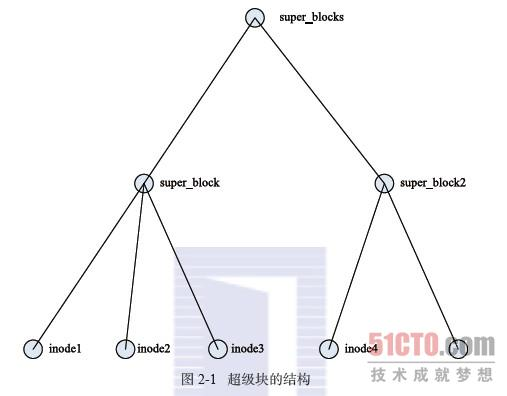

虚拟文件系统(VFS)是linux的内核软件层，它能够为各种文件系统提供通用的接口，例如linux，unix，windows系统。它是一个位于应用程序和具体文件之间的中间层。VFS引入了一个通用文件模型，它能够表示所有支持的文件系统，它包含有超级块对象、索引节点对象、文件对象、目录项对象。

### 超级块对象
存放已安装文件系统的有关信息，对基于磁盘的文件系统，它通常对应于存放在磁盘上的文件系统控制块。对于一个特定的文件系统，超级块的格式是固定的。每一个文件系统都对应一个超级块，它们都会链接到一个超级块链表，而文件系统中的每个文件在打开时都需要在内存分配一个inode结构它们都要链接到超级块。

